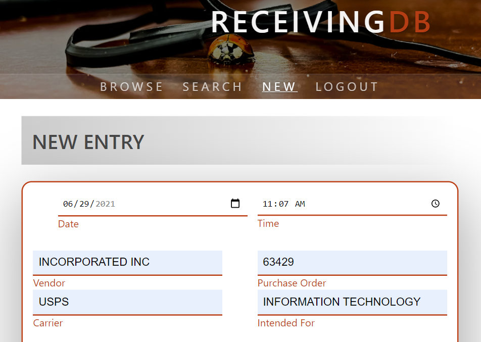

# User guide

Everything you need to know to successfully navigate ReceivingDB, from search
and browsing to auditing and administrating user accounts, users can find the
answer here.

- ##### [Browsing and searching](#browsing-and-searching)
  - ###### [Browsing](#browsing)
  - ###### [Searching](#searching)
    - ###### [By date range](#by-date-range)
    - ###### [By purchase order](#by-purchase-order)
    - ###### [By part number](#by-part-number)
    - ###### [By vendor](#by-vendor)
- ##### [Creating entries and best practices](#creating-entries-and-best-practices)
  - ###### [Creating new entries](#creating-new-entries)
  - ###### [Best practices for creating new entries](#best-practices-for-creating-new-entries)
- ##### [Auditing and audit trails](#auditing-and-audit-trails)
  - ###### [Auditing entries](#auditing-entries)
  - ###### [Audit trails](#audit-trails)
- ##### [Administering accounts, users and roles](#administering-accounts-users-and-roles)
  - ###### [Users](#users)
  - ###### [Creating new users/editing users](#creating-new-usersediting-users)
  - ###### [Passwords](#passwords)
  - ###### [Roles](#roles)
- ##### [Troubleshooting](#troubleshooting)
- ##### [Installation and getting started]
- ##### [API documentation]
- ##### [Docs page]

## Browsing and searching

ReceivingDB offers several ways to browse and search receiving log entries.  No
user account is required to search or browse ReceivingDB, though the web portal
itself may be restricted to an IP address or set of IP addresses.  Opening
access to the search and browse function cuts down on user account management,
as being on the same domain is enough to allow casual users to find the
information they need.

### Browsing

To browse the receiving log from ReceivingDB, select "Browse" from the
navigation menu.

The resulting page will load the last seven days of receiving log entries, from
newest to oldest, for users to browse through.  Click on any row, and use the
arrow keys or the tab key to navigate.  Selecting "Next" will take users back a
week, continuously until there are no more entries to be found.

Double-clicking on any row or pressing the enter key with a row selected will
take users to the entry details page.  From here, users can see items that were
shipped together as part of the same purchase order.

Some data points are not visible at specific breakpoints on mobile devices.
Viewing the entry details allows users to see data that might not be visible
from the browse page on mobile devices.

### Searching

ReceivingDB allows users to search by a custom date range, instead of looking
at the last seven days at a time, by purchase order, part number over a date
range, and vendor over a date range.

#### By date range

Entering in a custom date range lets users browse through any period.  For
example,  to see all the receiving log entries from May of 2021, search by the
date range `05/01/2021` through `05/31/2021`.  The result will bring users back
to the browse page, displaying all entries from May 2021 instead of the default,
the last seven days.

#### By purchase order

It might be the case that a purchase order comes in over several days, in
multiple shipments.  Searching by purchase order retrieves these disparate
entries and displays them all from the entry details page.  This combined entry
details page allows users to check and see if their purchase order has been
received in its entirety and as expected.

#### By part number

Search by part number to track orders with a specific part number. For example,
entering a part number and a date range brings the user back to the browse page
filtered down to just entries that include the part number in question.  Users
can adjust the date range to a custom period or leave it at the default, the
last six months.

#### By vendor

Searching by vendor returns the user to the browse page, filtered down to
entries that match the search query.  By default, searches by vendor return
matches from the last two months.  Users can enter a date range to search over a
custom period.

## Creating entries and best practices

Unlike browsing or searching, users must be logged in to a registered account
with the "WRITE" permission to add entries to the receiving log.  Only users
with the "WRITE" role will have access to the new entry form.

### Creating new entries

All top-level fields, date, time, vendor, purchase order, carrier, intended for,
are required.

All item details fields, item, MPN #, vendor lot/batch #, quantity, and unit,
are required for each item being added.  Entering data into any item input makes
the associated inputs necessary to submit the form.

Fields only become required once users begin entering data. Though the form
renders with inputs for three items, users can enter in less than three. So, for
example, users cannot have an item without a unit and quantity, but they can
create one item entry and leave the subsequent two instances blank.  Clicking on
"add more items" at the bottom of the form will create additional entry inputs
for receiving more than three items at a time.

### Best practices for creating new entries

There is a lot to be learned from past purchases and receiving log entries.
Have the number of purchases from a particular vendor gone up or done in the
last six months?  Are there items that are being ordered more than once a month?
Which carrier shipped which specific purchase order?  The data being stored in
ReceivingDB only has value if it is entered consistently enough to be searched
after that fact.  With that in mind, some best practices:

1. Be consistent in entering information.  Stick with either "UPS" or "United
   Parcel Service," "pounds", or "lbs," don't go back and forth between two
   similar options.
2. Do your best to describe quantities in useable units.  Using the quantity "2"
   and the unit "pallets" is vague as it is not clear how to quantify a pallet.
   Choosing the quantity "2" and the unit "pallets of 100 each" is more specific
   but difficult to use in future automation as it relies on parsing the string
   "pallets of 100 each" to arrive at an actual quantity.  If each pallet
   contains 100 each, and each unit is 1 lb, choosing the quantity "200" and the
   unit "lbs" is the best choice, as it is clear and easy to parse when trying
   to put together reports.
3. Double-check entries before submitting.  ReceivingDB is designed to be a
   write-once-read-many database.  Data shouldn't change after being entered.
   By default, users with the permissions required to write new entries do not
   have the permissions to edit them after the fact, so give everything a look
   over before submitting.

## Auditing and audit trails

The permission required to edit an existing entry exists independently of that
needed to create new entries.  Granting the role "Audit" to a user enables them
to make changes to the receiving log, creating an audit trail to reflect these
changes.  Note that the "AUDIT" role does not grant the "WRITE" permissions
required to create new entries, only to edit those that exist already.

### Auditing entries

With the "AUDIT" role enabled, viewing entry details will expose an "AUDIT"
option at the bottom of page.  Following this link will open up the entry for
editing similarly to the process for creating new entries.  The same required
fields and best practices described in creating new entries apply here as well.

### Audit trails

Once an entry has been audited, an audit trail will be visible to all users with
the "AUDIT" role.  The audit trail can be found at the bottom of any entry
details page, beneath the "AUDIT" option.

The auditor will be mentioned by name in the audit trail. For example, in the
image above, the auditor account has the first name "Audit" and the last name
"Account," which is slightly less than helpful.

## Administering accounts, users and roles

Registered users with the role "ADMIN" have the permissions required to make new
users, reset passwords, award roles, and disable accounts.

### Users

With the "ADMIN" role enabled, users gain access to the user management page.
Navigate with arrows or the tab key, double click a row, or use the enter key on
a selected row to see and edit user details.  Similarly to browsing the
receiving log, details are omitted on smaller displays.  Active users are
displayed by default.  Following the "disabled" link display, past users who
have been disallowed from logging in.  Selecting "new" allows the opportunity
for an admin to create additional registered user accounts.

### Creating new users/editing users

Creating new users and editing existing users are both achieved through the same
user form.  All fields are required.

#### Passwords

Set a default password for your users.  When creating a new user, "require
password reset on next login" is checked by default.  The "require password
reset" option allows administrators to set an initial password for their users
while allowing the end-user to create a secure password on their first login.
Existing users can also be forced into a password reset by selecting this option
and submitting the form.

#### Roles

Each role allows for specific web portal access.  All roles are disparate and
non-overlapping.  So, for example, applying the "AUDIT" role to a user does not
give them the permissions required to create new entries and vice-versa.
Granting the "DISABLED" role prevents a user from logging in or making changes.

| Role | Access |
| ---- | ------ |
| `WRITE` | Creates new receiving log entries, has access to "new" form |
| `AUDIT` | Edits existing entries, has access to edit and to view audit trail |
| `ADMIN` | Creates and administers users, has access to "user" table |
| `DISABLED` | Prevented from logging in or affecting changes |

## Troubleshooting

- Form does not submit
  Both the receiving log entry and user forms are used to create and edit
  entries and users, respectively.  Input is validated client-side and
  server-side to prevent injection attacks.  If the form does not submit,
  you should see a corresponding error message in red.

- Cannot access the web interface
  Double-check the IP_WHITELIST environment variable to verify that you are
  attempting access from a valid IP address.

- Lost access to user accounts
  Dropping the `users` collection from your database and restarting the
  application will recreate the initial default admin account without affecting
  your receiving log entries or audit data.

- Any other issues

[Please report any other issues] to the developer.

## Further Documentation

- **Need help with [installation and getting started]?**
- **Check out the [API documentation]**
- **Return to the [documentation landing page]**

[Please report any other issues]: https://github.com/iangoodnight/ReceivingDB/issues
[installation and getting started]: /ReceivingDB/installation.html
[Installation and getting started]: /ReceivingDB/installation.html
[API documentation]: /ReceivingDB/
[documentation landing page]: /ReceivingDB/
[Docs page]: /ReceivingDB/
